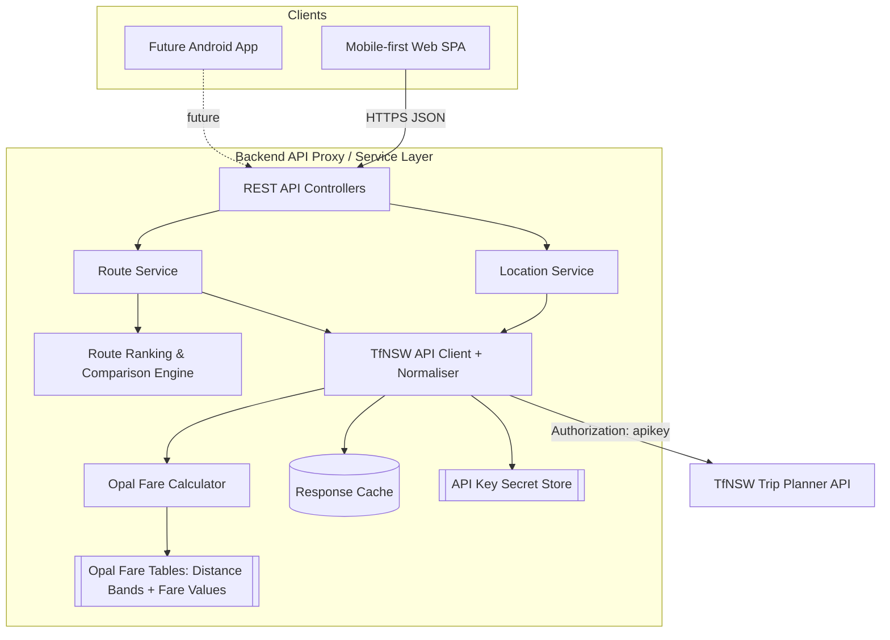
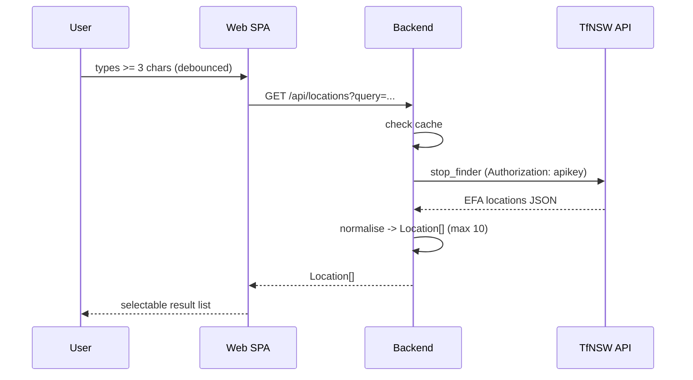

# Design Document

## Overview

The TfNSW Route Planner is a responsive, mobile-first web application that lets commuters search for transport locations, discover routes between an origin and a destination, and compare the fastest and most economical journey options using live data from the Transport for NSW (TfNSW) Trip Planner API.

The system is split into two deployable tiers:

1. **Web frontend** — a mobile-first single-page application (SPA) that handles search input, route display, route selection, and the side-by-side comparison view.
2. **Backend API proxy / service layer** — a stateless service that mediates all calls to the TfNSW API. It protects the API key, normalises the EFA (Elektronische Fahrplanauskunft) response format into clean domain models, applies caching, and houses the route-selection logic (fastest / economical / comparison).

This split is deliberate. The TfNSW API key must never be exposed to a browser or mobile client, and the planned native Android app must be able to reuse the same business logic. By placing location normalisation, route ranking, fare aggregation, and comparison logic in the backend service layer, both the web frontend and the future Android app become thin presentation clients over a single, well-tested API.

### Research Summary

Key findings that inform this design, verified against the official TfNSW Trip Planner API Swagger schema (efa11, `tripplanner_v1_swag_efa11_20251002.yml`) and the EFA response format:

- The **Trip Planner API** uses a single API key obtained from the TfNSW Open Data Hub, passed as an `Authorization: apikey <key>` HTTP header on every request. The base URL is `https://api.transport.nsw.gov.au/v1/tp/`. (Content was rephrased for compliance with licensing restrictions.)
- This feature uses two endpoints, both returning `rapidJSON` with coordinates in `EPSG:4326`:
  - **Stop Finder** (`stop_finder`) — autocomplete location search returning stops, stations, wharves, addresses, and points of interest with `id`, `name`, `disassembledName`, `coord`, `type`, `parent`, `matchQuality`, `isBest`, and `modes`.
  - **Trip Planner** (`trip`) — returns a set of `journeys`, each containing only `legs`, `rating`, and `isAdditional` (there is **no journey id**). Each leg carries `transportation.product.class` (an integer mode code), `duration` (seconds), `distance` (metres), and timing fields on its `origin`/`destination` stops.
- The API is EFA-based and returns JSON. Responses are verbose and nested; the backend normalises them into compact domain models.
- **Fares are NOT returned by the trip endpoint (critical).** The trip response contains no Opal fare or ticket data: the schema's `TripRequestResponseJourneyFareZone` is documented as "Not currently used", and legs only carry a `DIFFERENT_FARES` string flag (not a price). Opal fares must therefore be **computed by the backend** from each leg's `distance` and mode using the separate Opal Fares dataset — see the Opal Fare Calculator component. Computed fares are **estimates** and the UI must indicate this.
- **GTFS-Realtime Vehicle Positions** (live GPS) is available as a separate feed and is reserved as a later nice-to-have; it is out of scope for this design.

### Route Selection Rules (from requirements)

- **Fastest route** = lowest total `Travel_Time`. Tiebreak: fewest transfers.
- **Economical route** = lowest total `Fare_Cost`. Tiebreak: shortest `Travel_Time`. Routes with no fare data are excluded from economical ranking.

## Architecture



### Architectural Principles

- **Thin clients, smart backend**: All TfNSW integration, normalisation, ranking, and comparison logic lives in the backend so it is shared and tested once.
- **API key isolation**: The key is read from a secret store / environment variable on the backend only. It is never sent to clients and never appears in client-bound responses or logs.
- **Statelessness**: The backend holds no per-user session state. Each request carries the data it needs (selected origin/destination IDs, time). This keeps the service horizontally scalable and equally consumable by web and Android.
- **Normalisation boundary**: The `TfNSW API Client + Normaliser` is the only component aware of the raw EFA JSON shape. Everything above it works with clean domain models (`Location`, `Journey`, `Leg`, `Fare`, `RouteComparison`).
- **Fares are computed, not fetched**: Because the trip endpoint returns no Opal fare data, the `Opal Fare Calculator` derives each leg's fare from its `distance` (metres) and mode using the separately maintained Opal fare tables. All fares surfaced to clients are estimates.
- **Mobile-first responsive UI**: The frontend uses responsive layout breakpoints so the same components scale from phone to desktop, easing the later Android port.

### Request Flows

**Location search (Requirement 1):**


**Route discovery + ranking (Requirements 2-5):**
```mermaid
sequenceDiagram
    participant W as Web SPA
    participant B as Backend
    participant T as TfNSW API
    W->>B: GET /api/routes?originId=&destId=&time=
    B->>B: validate origin != destination
    B->>T: trip request (Authorization: apikey)
    T-->>B: EFA journeys JSON (no fares)
    B->>B: normalise -> Journey[] (max 5, by departure)
    B->>B: compute per-leg Opal fare estimates (distance + mode)
    B->>B: assign synthetic journey ids; compute fastest, economical, comparison
    B-->>W: RouteResult { journeys, fastestId, economicalId, comparison }
```

## Components and Interfaces

### Frontend Components

- **LocationSearchField** — Debounced autocomplete input (origin and destination instances). Enforces the 3-character minimum, clears results below threshold, renders the selectable result list (name, type, suburb), and surfaces "no locations found" / "service unavailable" states while retaining typed text.
- **RouteSearchController** — Enables route search only when both origin and destination are selected and they differ; otherwise shows the same-location validation message.
- **RouteList** — Renders up to 5 routes ordered by departure time; shows departure/arrival, total travel time, transfers, and transport modes. Visually badges the fastest and the economical routes.
- **JourneyDetailView** — Shows full leg-by-leg journey details (per-leg departure/arrival, mode, platform where available, and per-leg + total fare for the economical selection). Renders directly from the already-fetched journey data in the route result — no separate detail fetch is made — and clearly labels fares as estimates.
- **RouteComparisonView** — Side-by-side fastest vs economical presentation with travel-time and fare differences and faster/cheaper labels. Collapses to a single route when they coincide. Handles the "fare unavailable for fastest route" notice.

### Backend Interfaces

```typescript
// Location Service
interface LocationService {
  // Returns up to 10 normalised locations. Throws ServiceUnavailableError on upstream failure.
  searchLocations(query: string): Promise<Location[]>;
}

// Route Service
interface RouteService {
  // Validates inputs, fetches and normalises up to 5 journeys ordered by departure time,
  // then computes ranking + comparison.
  planRoutes(request: RouteRequest): Promise<RouteResult>;
}

// Route Ranking & Comparison Engine (pure functions over normalised journeys)
interface RouteRankingEngine {
  selectFastest(journeys: Journey[]): Journey | null;
  selectEconomical(journeys: Journey[]): Journey | null;
  buildComparison(fastest: Journey | null, economical: Journey | null): RouteComparison;
}

// TfNSW API Client + Normaliser (only component aware of EFA JSON)
interface TfnswClient {
  stopFinder(query: string): Promise<Location[]>;
  trip(originId: string, destinationId: string, time: Date, mode: 'dep' | 'arr'): Promise<Journey[]>;
}

// Opal Fare Calculator (pure function over leg distance + mode)
// Computes an ESTIMATED adult Opal fare from distance bands per mode.
// Loads the Opal Distance Tables and Opal Fare Values as configuration/data.
interface OpalFareCalculator {
  // Returns an estimated fare for a single priced leg, or null if the mode is unpriceable
  // (e.g. walk/bicycle) or no band matches.
  estimateLegFare(distanceMetres: number, mode: TransportMode): Fare | null;
}
```

> **Fare calculator scope (decision):** The first implementation is a **distance-band estimate** — each mode maps the leg `distance` (metres) to a distance band, and each band maps to a fare value, with rail treated approximately. **Transfer discounts and daily/weekly fare caps are explicitly deferred** as a future enhancement. The Opal fare tables (distance bands and fare values) are loaded as configuration/data, not hard-coded into logic, so they can be updated when Opal pricing changes.

### REST API Endpoints

| Method | Path | Purpose | Auth |
|---|---|---|---|
| `GET` | `/api/locations?query={q}` | Location autocomplete (Req 1) | None (public, see Security) |
| `GET` | `/api/routes?originId={o}&destinationId={d}&time={iso}` | Route discovery + ranking + comparison, with full leg-by-leg detail per journey (Req 2-5) | None (public, see Security) |

> **No journey-detail endpoint:** The TfNSW API has no journey id and no per-journey detail endpoint. The `/api/routes` response already contains complete leg-by-leg detail for every journey, so the detail view (Req 3.2, 4.2, 5.5) renders from the already-fetched data. The backend assigns a **synthetic** `id` to each journey (a hash/index of its content) purely so the client can select a journey from the result set.

> **Security note (flagged):** These endpoints are intentionally **unauthenticated** for end users — the app requires no login. This is a deliberate decision recorded in the Security section, not an oversight. The endpoints are public read-only proxies. Because they trigger upstream calls against a rate-limited, keyed third-party API, they MUST be protected by rate limiting and input validation to prevent abuse and quota exhaustion. See the Security section.

## Data Models

All models are the normalised, client-facing representations produced by the normaliser. They are independent of the raw EFA JSON.

```typescript
// A transport stop, station, platform, or point of interest.
interface Location {
  id: string;            // TfNSW location id (used as origin/destination)
  name: string;          // display name (full `name`, may include suburb)
  type: LocationType;    // mapped from EFA `type` (see EFA Response Mapping)
  suburb: string | null; // parent locality, where provided
  coord: {               // EFA `coord` is [latitude, longitude] (EPSG:4326)
    lat: number;
    lng: number;
  } | null;
}

type LocationType = 'stop' | 'station' | 'platform' | 'poi' | 'address' | 'suburb';
type TransportMode = 'train' | 'metro' | 'bus' | 'ferry' | 'lightRail' | 'coach' | 'walk' | 'bicycle' | 'school' | 'other';

// A single leg of a journey (one vehicle ride or a walk/transfer).
interface Leg {
  origin: LegStop;
  destination: LegStop;
  mode: TransportMode;        // derived from transportation.product.class
  routeName: string | null;   // e.g. "T1 North Shore Line", "389"
  departureTime: string;      // ISO 8601 UTC; estimated if present, else planned
  arrivalTime: string;        // ISO 8601 UTC; estimated if present, else planned
  durationMinutes: number;    // from EFA leg.duration (seconds) / 60
  distanceMetres: number | null; // EFA leg.distance, used for fare estimation
  isTransfer: boolean;        // true for walk/transfer connector legs
  fare: Fare | null;          // ESTIMATED per-leg adult Opal fare (computed, not from TfNSW)
}

interface LegStop {
  locationName: string;
  platform: string | null;    // derived from stop disassembledName/name/properties; may be null
  time: string;               // ISO 8601 UTC; estimated time if present, else planned
}

// Monetary fare value. Amounts are integer cents to avoid float rounding errors.
interface Fare {
  amountCents: number;        // >= 0, ESTIMATED adult Opal fare
  currency: 'AUD';
}

// A complete journey option from origin to destination.
interface Journey {
  id: string;                 // SYNTHETIC id assigned by the backend (hash/index of journey);
                              // NOT from TfNSW — the trip API has no journey id
  legs: Leg[];                // ordered, length >= 1
  departureTime: string;      // ISO 8601 = first leg departure
  arrivalTime: string;        // ISO 8601 = last leg arrival
  travelTimeMinutes: number;  // arrival - departure (includes transfer waits)
  transferCount: number;      // number of vehicle changes
  modes: TransportMode[];     // distinct transport modes used, in order
  totalFare: Fare | null;     // sum of ESTIMATED leg fares; null if any priced leg is unpriceable
}

// Request to plan routes.
interface RouteRequest {
  originId: string;
  destinationId: string;
  time: string;               // ISO 8601 desired departure time
}

// Result of route discovery + ranking.
interface RouteResult {
  journeys: Journey[];        // up to 5, ordered by departureTime
  fastestId: string | null;
  economicalId: string | null;
  comparison: RouteComparison;
}

// Side-by-side comparison of fastest vs economical (Requirement 5).
interface RouteComparison {
  fastest: ComparisonEntry | null;
  economical: ComparisonEntry | null;
  sameRoute: boolean;                 // true when fastest === economical
  travelTimeDifferenceMinutes: number | null; // |fastest - economical|
  fareDifferenceCents: number | null;          // |fastest - economical|, null if either fare missing
  fasterRouteId: string | null;
  cheaperRouteId: string | null;
  fareUnavailableForFastest: boolean; // Req 5.6
}

interface ComparisonEntry {
  journeyId: string;
  travelTimeMinutes: number;
  totalFare: Fare | null;
  transferCount: number;
  modes: TransportMode[];
}
```

### Model Notes

- **Money as integer cents**: `Fare.amountCents` avoids floating-point rounding. Display formatting (AUD to two decimals) happens at the presentation boundary.
- **Fares are estimates**: All `Fare` values are computed by the Opal Fare Calculator from leg distance and mode, not returned by TfNSW. The UI must label them as estimates.
- **Synthetic journey id**: `Journey.id` is assigned by the backend (e.g. a stable hash of the journey's legs/times, or its index in the result) solely for client-side selection. TfNSW supplies no journey id.
- **Travel time definition**: `travelTimeMinutes` is the difference between the last leg's arrival and the first leg's departure (estimated where available, else planned), inherently including transfer waiting time (Req 3.3).
- **Transfer count**: number of vehicle changes, derived from the count of non-walk vehicle legs minus one (floored at zero), matching the user-facing "number of transfers".
- **Fare aggregation**: `totalFare` is the sum of per-leg estimated fares. If any fare-bearing (priced) leg cannot be priced, `totalFare` is `null` and the journey is excluded from economical ranking (Req 4.4).

### EFA Response Mapping

The normaliser is the only component aware of the raw EFA JSON. Verified mappings against the efa11 Swagger schema:

**Stop Finder (location) fields:**
- `id` → `Location.id`; `name` → `Location.name`; `disassembledName` is the short name (no suburb) used for display/platform hints.
- `coord` is `[latitude, longitude]` (latitude first; `coordOutputFormat=EPSG:4326`) → `coord.lat`, `coord.lng`.
- `type` enum is one of `poi | singlehouse | stop | platform | street | locality | suburb | address | unknown`. Mapping to `LocationType`:
  - `stop` → `stop`, `platform` → `platform`, `poi` → `poi`
  - `singlehouse` / `street` / `address` → `address`
  - `locality` / `suburb` → `suburb`
  - **`unknown` → dropped** (the schema states these indicate bad data and can be safely ignored).
- `parent` (`ParentLocation`) supplies the suburb/locality where present → `Location.suburb`.
- `matchQuality` (higher = better) is used to **sort** results; `isBest` flags the best match; `modes[]` are integer mode codes.

**Journey fields:**
- A journey has only `legs`, `rating`, and `isAdditional` — **there is no journey id field**. `Journey.id` is backend-assigned (synthetic).

**Leg fields:**
- Times live on the **stops**, not the leg: `origin.departureTimePlanned` / `origin.departureTimeEstimated` and `destination.arrivalTimePlanned` / `destination.arrivalTimeEstimated`, in ISO 8601 UTC (`YYYY-MM-DDTHH:MM:SSZ`). Use the **estimated** value when present (real-time), otherwise the **planned** value.
- `leg.duration` is in **seconds**; `leg.distance` is in **metres** (used by the fare calculator).
- Each intermediate stop in `stopSequence` may carry both arrival and departure times.
- **Platform** is not a dedicated field — derive it from the stop's `disassembledName` / `name` (or `properties` where available); may be `null`.

**Transport mode** — derive from `transportation.product.class` (integer):

| `class` | TransportMode |
|---|---|
| 1 | `train` |
| 2 | `metro` |
| 4 | `lightRail` |
| 5 | `bus` |
| 7 | `coach` |
| 9 | `ferry` |
| 11 | `school` (School Bus) |
| 99 / 100 | `walk` |
| 101 | `bicycle` |

Walk (`99`/`100`) and bicycle (`101`) legs are treated as transfers/connectors and are unpriced by the fare calculator.

**Fares:** The trip response carries **no fare data** — `TripRequestResponseJourneyFareZone` is "Not currently used", and legs only expose a `DIFFERENT_FARES` string flag (not a price). The normaliser therefore populates each priced leg's `fare` by calling the Opal Fare Calculator with the leg's `distance` and `mode`.

### TfNSW Client Request Details

All requests use base URL `https://api.transport.nsw.gov.au/v1/tp/`, header `Authorization: apikey <key>`, and common params `outputFormat=rapidJSON`, `coordOutputFormat=EPSG:4326`.

- **`stop_finder`**: `type_sf=any`, `name_sf=<query>`, `TfNSWSF=true`, `anyMaxSizeHitList`, `odvSugMacro=1`.
- **`trip`**: `type_origin=stop`, `name_origin=<id>`, `type_destination=stop`, `name_destination=<id>`, `depArrMacro=dep|arr`, `itdDate=YYYYMMDD`, `itdTime=HHMM`, `TfNSWTR=true`. The `itdDate`/`itdTime` values are **Sydney local** time for the request.

## Correctness Properties

*A property is a characteristic or behavior that should hold true across all valid executions of a system — essentially, a formal statement about what the system should do. Properties serve as the bridge between human-readable specifications and machine-verifiable correctness guarantees.*

The route-ranking engine, fare aggregation, comparison math, formatting helpers, and EFA normaliser are all pure functions over data, making them excellent candidates for property-based testing. The properties below are derived from the prework analysis. UI interactions, empty-state messaging, and upstream error handling are validated by example-based and edge-case tests (see Testing Strategy) rather than properties.

> **Fare calculator note:** The Opal Fare Calculator's distance-band mapping (which band a given distance falls into, and the fare value for that band) is validated by **example-based tests** that pin the exact band boundaries per mode, rather than by a universal property. The fare *aggregation* logic that consumes calculator output (Property 8) and the economical-selection logic (Property 9) remain property-based, since they operate on the domain model independent of how individual fares were derived.

### Property 1: Location results are capped at 10

*For any* upstream stop-finder response containing N location entries, the normalised location list returned by `searchLocations` has length equal to `min(N, 10)`.

**Validates: Requirements 1.1**

### Property 2: Normalised locations are complete

*For any* upstream location entry, the resulting normalised `Location` has a non-empty `name` and a `type` drawn from the valid `LocationType` set.

**Validates: Requirements 1.2**

### Property 3: Short queries never reach the API

*For any* query string whose trimmed length is less than 3, `searchLocations` does not invoke the TfNSW client and yields an empty result set (clearing any previous results).

**Validates: Requirements 1.6**

### Property 4: Journeys are capped at 5 and ordered by departure

*For any* set of upstream journeys, the normalised journey list returned by `planRoutes` has length at most 5 and is ordered by non-decreasing `departureTime`.

**Validates: Requirements 2.2**

### Property 5: Travel time equals arrival minus departure including transfer waits

*For any* journey, `travelTimeMinutes` equals the number of minutes between the first leg's scheduled departure and the last leg's scheduled arrival (which inherently includes transfer waiting time).

**Validates: Requirements 2.3, 3.3**

### Property 6: Identical origin and destination are rejected

*For any* location id, calling `planRoutes` with that id as both origin and destination raises a validation error and does not invoke the TfNSW client.

**Validates: Requirements 2.5**

### Property 7: Fastest selection minimises travel time then transfers

*For any* non-empty journey list, the journey chosen by `selectFastest` has a `travelTimeMinutes` less than or equal to every other journey's, and among all journeys sharing that minimum travel time, none has a strictly smaller `transferCount` than the chosen one.

**Validates: Requirements 3.1**

### Property 8: Total fare equals the sum of leg fares

*For any* journey whose fare-bearing legs all have fare data, `totalFare.amountCents` equals the sum of the `amountCents` of its legs.

**Validates: Requirements 4.2**

### Property 9: Economical selection minimises fare among priced routes and excludes unpriced routes

*For any* journey list, if `selectEconomical` returns a journey then that journey has a non-null `totalFare` whose `amountCents` is less than or equal to every other priced journey's, and among journeys sharing that minimum fare none has a strictly shorter `travelTimeMinutes`; journeys with null `totalFare` are never selected.

**Validates: Requirements 4.1, 4.4**

### Property 10: Comparison differences and faster/cheaper labels are consistent

*For any* two journeys (a fastest and an economical), the `RouteComparison` reports `travelTimeDifferenceMinutes` equal to the absolute difference of their travel times, `fareDifferenceCents` equal to the absolute difference of their fares (or null when either fare is missing), and labels `fasterRouteId` / `cheaperRouteId` as the journey with the lower travel time / fare respectively.

**Validates: Requirements 5.3**

### Property 11: Formatting helpers are exact and reversible

*For any* non-negative cents value, the AUD formatter produces a string with exactly two decimal places whose numeric value equals `cents / 100`; and *for any* non-negative minutes value, the duration formatter produces hours and minutes that recompose to the original minutes value.

**Validates: Requirements 5.2**

### Property 12: Coinciding fastest and economical collapse to a single route

*For any* journey list in which one journey is simultaneously the fastest and the economical selection, `buildComparison` sets `sameRoute` to true and presents that single journey as both the fastest and most economical option.

**Validates: Requirements 5.4**

### Property 13: Missing fare on the fastest route is handled in comparison

*For any* journey list whose fastest journey has a null `totalFare`, `buildComparison` sets `fareUnavailableForFastest` to true and `fareDifferenceCents` to null, while still reporting travel time and transfer count.

**Validates: Requirements 5.6**

### Property 14: EFA normalisation round-trip

*For any* valid domain `Location` or `Journey`, encoding it into an EFA-shaped payload — using the verified field mappings (location `coord` as `[lat, lng]`, `type` enum mapping, leg times on the `origin`/`destination` stops via `departureTimePlanned`/`departureTimeEstimated` and `arrivalTimePlanned`/`arrivalTimeEstimated`, `leg.duration` in seconds, `leg.distance` in metres, and mode from `transportation.product.class`) — and passing it through the normaliser reproduces an equivalent domain model for all fields the TfNSW API carries. (The synthetic `Journey.id` and the computed `fare`/`totalFare` are excluded, since they are not part of the upstream payload.)

**Validates: Requirements 1.2, 2.3**

## Error Handling

The system distinguishes recoverable user-facing conditions from upstream failures, and maps each to a clear client response.

| Condition | Detection | Client-facing behavior | Requirement |
|---|---|---|---|
| Query < 3 chars | Frontend guard + backend validation | No API call; results cleared | 1.6 |
| No matching locations | Empty normalised list | "No locations found for the given query" | 1.4 |
| TfNSW unreachable / error (search) | HTTP error / timeout from client | "Service temporarily unavailable"; typed text retained | 1.5 |
| Origin == destination | Backend validation before API call | Validation message; search prevented | 2.5 |
| No routes available | Empty normalised journeys | "No routes found" + suggest changing origin/destination/time | 2.4 |
| TfNSW unreachable / error (route) | HTTP error / timeout from client | "Service temporarily unavailable"; selections retained | 2.6 |
| Route/journey detail retrieval fails | HTTP error / timeout on the `/api/routes` request (detail is part of this response, not fetched separately) | "Journey details could not be loaded" + retry action | 3.4 |
| Fare unpriceable for a journey | Null `totalFare` after fare estimation | Excluded from economical ranking; "fare estimate not available" shown | 4.4 |
| Fare missing for fastest in comparison | `fareUnavailableForFastest` flag | Notice shown; compare on time + transfers only | 5.6 |

### Error Model

- The backend defines typed errors: `ValidationError` (400) and `ServiceUnavailableError` (502/503 for upstream failures). Because journeys are not fetched by id, there is no journey `NotFoundError`; a failure to produce journey detail is part of the `/api/routes` request outcome (Req 3.4).
- Upstream calls use bounded timeouts (search ≤ 3s budget, route ≤ 5s budget) and a single short retry with backoff on transient network errors before surfacing `ServiceUnavailableError`.
- Error responses use a consistent JSON envelope `{ "error": { "code": string, "message": string } }`. The TfNSW API key and raw upstream payloads are never included in error responses or logs.

## Caching Strategy

Caching reduces latency, smooths the TfNSW rate limit, and improves the experience for both web and the future Android client.

- **Stop Finder responses**: cached keyed by normalised (lowercased, trimmed) query string. Location data changes infrequently, so a TTL of ~24 hours is appropriate.
- **Trip responses**: cached keyed by `(originId, destinationId, time-bucket)` with a short TTL (~60 seconds), because schedules and the implicit "now" change quickly. Requests without an explicit time round the time to a small bucket to improve hit rate while staying current.
- **Cache placement**: in the backend service layer (in-memory LRU for a single instance; a shared cache such as Redis if horizontally scaled). Clients receive `Cache-Control` headers so the SPA may also do brief client-side caching of autocomplete results.
- **Invalidation**: TTL-based expiry only; no manual invalidation needed for read-only proxied data.

## Security

- **API key protection (primary driver)**: The TfNSW API key is stored in a backend secret store / environment variable and injected into the `Authorization: apikey <key>` header by the `TfnswClient` only. It is never sent to clients, never embedded in frontend bundles, and never written to logs or error responses. This is the central reason the architecture uses a backend proxy rather than calling TfNSW directly from the browser.
- **Unauthenticated public endpoints (flagged decision)**: The `/api/locations` and `/api/routes` endpoints require **no end-user authentication** because the product has no user accounts or per-user data. This is an intentional design decision, not an omission. Because these endpoints proxy a keyed, rate-limited third-party API, they MUST be protected against abuse by:
  - **Rate limiting** per client IP (and an overall global ceiling) to protect the shared TfNSW quota.
  - **Strict input validation**: query length bounds, allowlisted parameters, and validated location-id and ISO time formats to prevent injection and malformed upstream calls.
  - **CORS** restricted to the known web origin(s).
- **Transport security**: All client-backend and backend-TfNSW traffic uses HTTPS.
- **No PII**: The system stores no personal data; requests carry only location ids and times. Logs record request metadata without secrets or full upstream payloads.
- **Untrusted upstream data**: EFA responses are treated as untrusted input — the normaliser validates and coerces fields rather than trusting structure, and output is encoded safely by the frontend to prevent injection via location names.

## Testing Strategy

A dual approach combines property-based tests for universal logic with example/edge/integration tests for specific behaviors and external boundaries.

### Property-Based Tests

- **Library**: a mature PBT library for the implementation language (e.g. `fast-check` for TypeScript, `Hypothesis` for Python). Property-based testing is NOT implemented from scratch.
- **Iterations**: each property test runs a minimum of **100 iterations**.
- **Traceability**: each property test is tagged with a comment referencing its design property, in the format:
  `Feature: tfnsw-route-planner, Property {number}: {property_text}`
- **Coverage**: Properties 1–14 above are each implemented by a single property-based test. Generators produce randomised journeys (varying leg counts, modes, times, transfer counts, and fares including missing-fare cases), location lists (varying sizes including > 10), and query strings (including whitespace-only and sub-3-character inputs).
- **Edge cases via generators**: empty/whitespace queries, journeys with a single leg, walk-only journeys with no fare, ties on travel time and on fare, large result sets (to exercise the caps), and non-ASCII location names are produced by the generators so the relevant properties cover them.

### Example-Based Unit Tests

Focused tests for behaviors that are not universal:
- Selecting a location stores it in the originating field (Req 1.3).
- Empty location result renders the "no locations found" message (Req 1.4).
- Route search enable/disable based on origin/destination selection (Req 2.1).
- Empty route result renders the "no routes found" + suggestion message (Req 2.4).
- Detail views render leg info including platform when present (Req 3.2, 4.2, 5.5).
- Opal Fare Calculator distance-band boundaries: each mode's exact band boundaries map to the correct fare value (e.g. a distance just below vs just above a band edge yields the adjacent fares), and walk/bicycle legs return null (Req 4.3).
- Comparison view renders both entries side by side (Req 5.1).

### Edge-Case / Error Tests

- Upstream failure during search surfaces `ServiceUnavailableError` and the SPA retains typed text (Req 1.5).
- Upstream failure during route search retains selections (Req 2.6).
- Journey detail fetch failure shows the error and exposes a retry action (Req 3.4). Since detail is part of the `/api/routes` response, this is exercised by failing that request.

### Integration Tests

A small number (1–3 examples) verifying the real wiring, not run at scale:
- The `TfnswClient` sends the `Authorization` header and parses a recorded real EFA stop-finder and trip response into domain models, including computing per-leg Opal fare estimates from leg distance and mode.
- The performance budgets (3s search, 5s route) are checked against the live/recorded endpoint as smoke-level assertions.
- Rate limiting rejects requests exceeding the configured threshold.

### Frontend / Responsive Tests

- Snapshot and responsive-layout tests confirm mobile-first breakpoints render correctly across phone and desktop widths. (UI rendering is validated by snapshot/example tests rather than property-based tests.)
